  <picture>
    <source media="(prefers-color-scheme: dark)" srcset="./dark.svg">
    <source media="(prefers-color-scheme: light)" srcset="./light.svg">
    
  </picture>

Pranav pandey  

Typing taglines -- Cybersecurity developer or anylsit 

Location deheradun uttarkhand 

Education -- BCA 

Current focus --   cybersecurity /linux /networking/coud security 

Remove portfolio 

Email -- pandeypranav70198@gmail.com 

Skill -- PYTHON LINUX NETWORKING 

Social links: GitHub PranavPandey18 

Linkdin -- 

[https://www.linkedin.com/in/pranav-pandey-680b682a7](https://www.linkedin.com/in/pranav-pandey-680b682a7?utm_source=share_via&utm_content=profile&utm_medium=member_android)

Instagram --https://www.instagram.com/prana.vr18

Any preference for the ASCII portrait — a specific image/photo to convert to ASCII art, or should I use a generic cyber/terminal-style silhouette?  Yes make my cybersecurity computer and display my name on it
